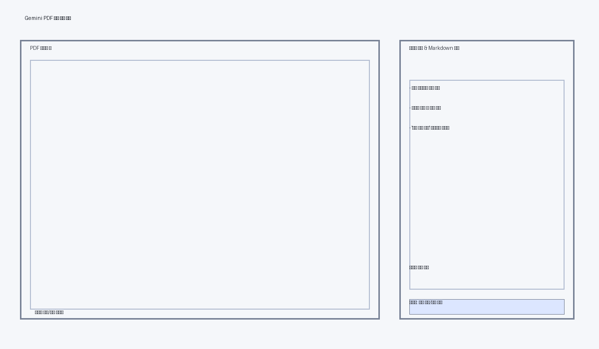

# Gemini PDF 해설 뷰어

Google Gemini API를 이용해 PDF 각 페이지를 요약/해설하고, 원본 페이지와 해설을 나란히 보여주는 데스크톱 앱입니다. 모든 페이지를 개별적으로 분석하며, 직전/다음 페이지의 문맥을 반영해 연결감 있는 설명을 제공합니다.

## 주요 특징
- **Gemini 요약**: 페이지별 텍스트를 추출해 Gemini 모델(`gemini-2.5-flash` 기본)로 해설을 받아옵니다.
- **이미지 설명**: 각 페이지를 고해상도 이미지로 캡처해 Gemini에 함께 전달하여 그림/도표를 텍스트 설명과 자연스럽게 통합합니다.
- **문맥 반영 해설**: 각 페이지 해설을 생성할 때 직전/다음 페이지 텍스트 일부를 함께 제공해 흐름을 잇는 설명을 만듭니다.
- **사전 로딩**: UI를 띄우기 전에 CLI에서 모든 페이지 해설을 순차적으로 요청해 진행률을 확인할 수 있습니다.
- **페이지 단위 캐시**: 모든 페이지를 개별 항목으로 다루고, API 응답은 로컬 JSON 캐시에 저장해 같은 페이지를 반복 요청하지 않습니다.
- **GUI 뷰어**: PyQt6 기반 2분할 뷰. 왼쪽은 PDF 페이지 뷰어(배율 조절·페이지 이동), 오른쪽은 페이지 목록과 Markdown 해설 창.
- **비동기 요청**: 해설은 백그라운드 스레드에서 요청되어 UI가 멈추지 않습니다.

## 설치
Python 3.10+ 환경을 권장하며, 3.9에서도 `importlib-metadata` 백포트가 자동으로 사용됩니다.

```bash
pip install -r requirements.txt
```

필요 패키지: `PyMuPDF`, `PyQt6`, `google-generativeai`, `Pillow`.

## 사용 순서
1. **API 키 설정**
   ```bash
   export GOOGLE_API_KEY="your-key"
   ```
2. **모델 확인(선택 사항)** – 사용 가능한 Gemini 모델을 확인합니다.
   ```bash
   python app.py --list-models --api-key "$GOOGLE_API_KEY"
   ```
3. **앱 실행 및 사전 로딩** – CLI에 `[n/total]` 로그가 표시되며 모든 페이지 해설을 준비합니다.
   ```bash
   python app.py path/to/file.pdf \
     --model gemini-2.5-flash \
     --max-text-chars 20000 \
     --cache-dir .cache
   ```
4. **UI 사용**
   - 좌측 하단 컨트롤로 페이지 이동/배율을 조절합니다.
   - 우측 목록에서 원하는 페이지를 선택하면 즉시 이동하며, Markdown 해설이 나타납니다.
   - `해설 새로 요청` 버튼을 누르면 해당 페이지의 해설을 재생성하며, 콘솔 로그와 우측 진행 바/상태바를 통해 로딩 상태를 확인할 수 있습니다.
   - 상태바는 “불러오는 중…/업데이트 완료/실패” 메시지를 표시하므로 수동 요청이 실제로 실행되었는지 손쉽게 검증할 수 있습니다.

### 주요 옵션
- `--model`: 사용할 Gemini 모델 이름.
- `--max-text-chars`: 페이지 전체 텍스트를 잘라낼 최대 글자 수 (토큰 제한 회피용, 기본 20,000자).
- `--context-text-chars`: 이전/다음 페이지 문맥으로 사용할 최대 글자 수.
- `--max-image-pixels`: 페이지 스크린샷을 전송하기 전 축소할 최대 픽셀 수(예: 512x512=262,144).
- `--cache-dir`: 요약을 JSON으로 저장할 디렉터리.
- `--skip-gemini`: UI만 띄우고 해설 요청을 건너뜀(테스트/데모용).
- `--list-models`: 현재 계정에서 `generateContent`를 지원하는 모델 목록만 출력하고 종료.

## 스크린샷
CLI에서 페이지를 모두 로딩한 뒤 UI가 열리면 아래와 같이 왼쪽에 PDF, 오른쪽에 Markdown 해설/진행 표시가 나타납니다.



## UI 사용법
- 좌측 하단 컨트롤로 페이지 이동(`◀ 이전`, `다음 ▶`, 숫자 입력) 및 배율 조절.
- 우측 상단 목록에서 페이지를 직접 선택하면 해당 페이지로 이동하고 해설을 표시합니다.
- 캐시된 해설은 즉시 출력되며, 없으면 자동으로 Gemini 요청을 보냅니다.
- `해설 새로 요청` 버튼으로 현재 페이지 해설을 강제로 재요청합니다.
  (초기 실행 시 이미 모든 페이지 요약이 준비되므로 즉시 표시됩니다.)

## 캐시와 데이터 저장 위치
- 기본 캐시 디렉터리: `.cache/`. PDF 파일명 기반 `*_summaries.json`에 저장됩니다.
- 캐시 키는 PDF 해시 + 페이지 ID 조합으로 구성되어, 같은 PDF라도 수정되면 새로 요약합니다.

## 제한 및 참고 사항
- Gemini API 호출은 비용이 발생할 수 있으며, 네트워크 연결이 가능해야 합니다.
- 페이지 수가 많은 PDF는 요청 횟수가 많으므로 API 비용/시간을 고려하세요.
- 현재는 텍스트 기반 PDF 추출에 최적화되어 있으므로 스캔본(이미지) PDF는 해설을 생성하지 못할 수 있습니다.
- PyQt6 GUI는 macOS/Windows/Linux에서 테스트할 수 있지만, Wayland 환경에서는 추가 설정이 필요할 수 있습니다.
